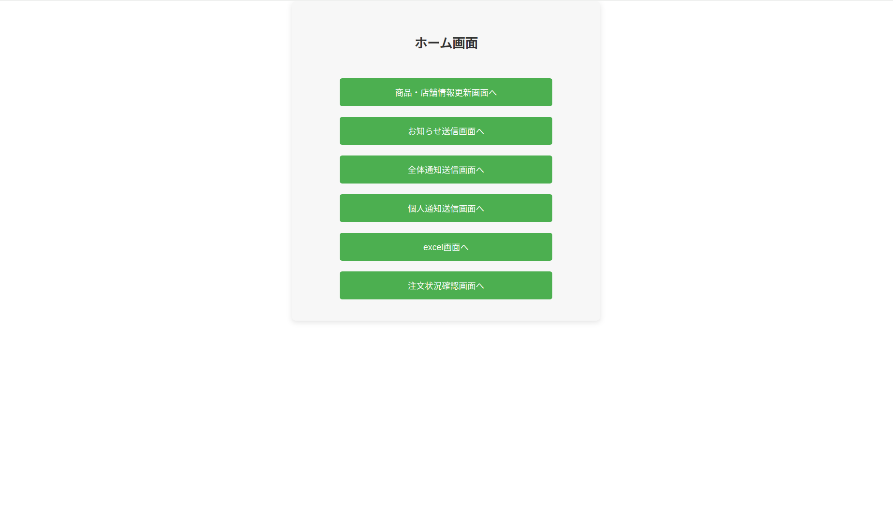
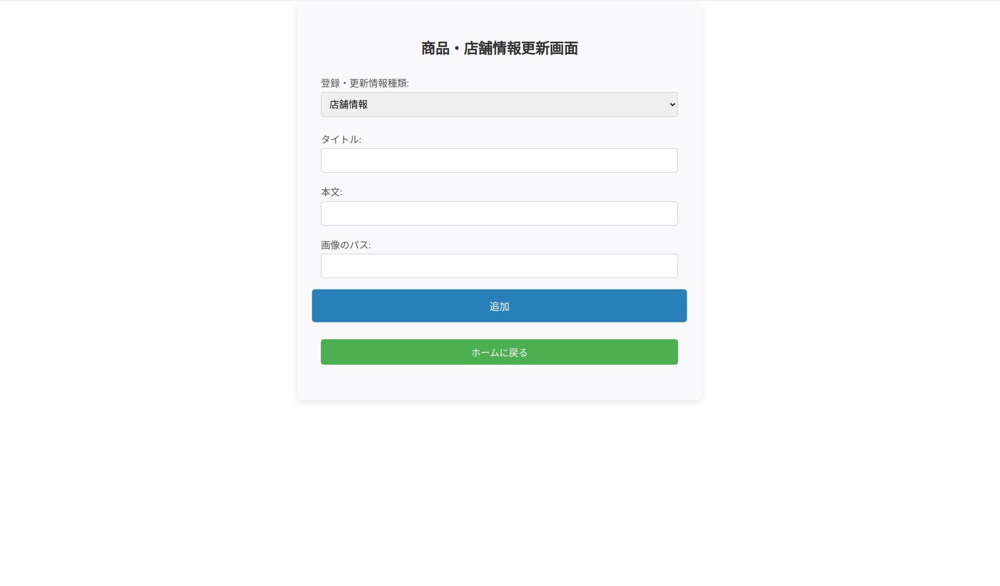
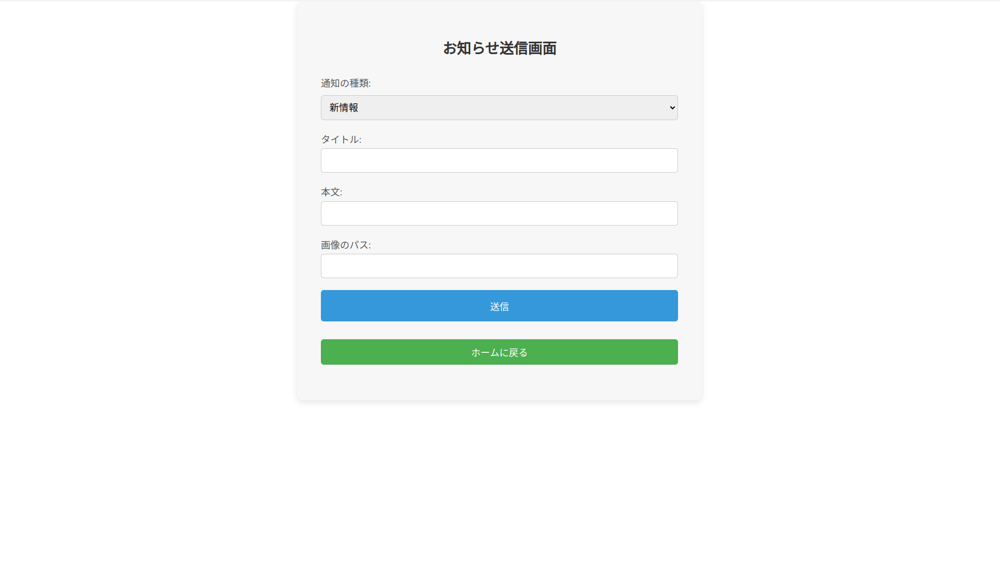
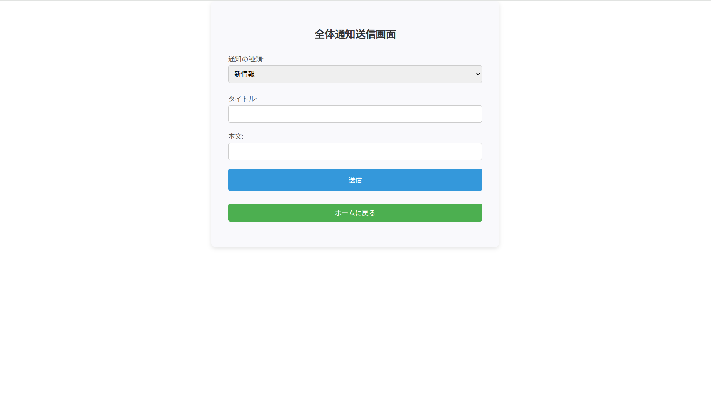
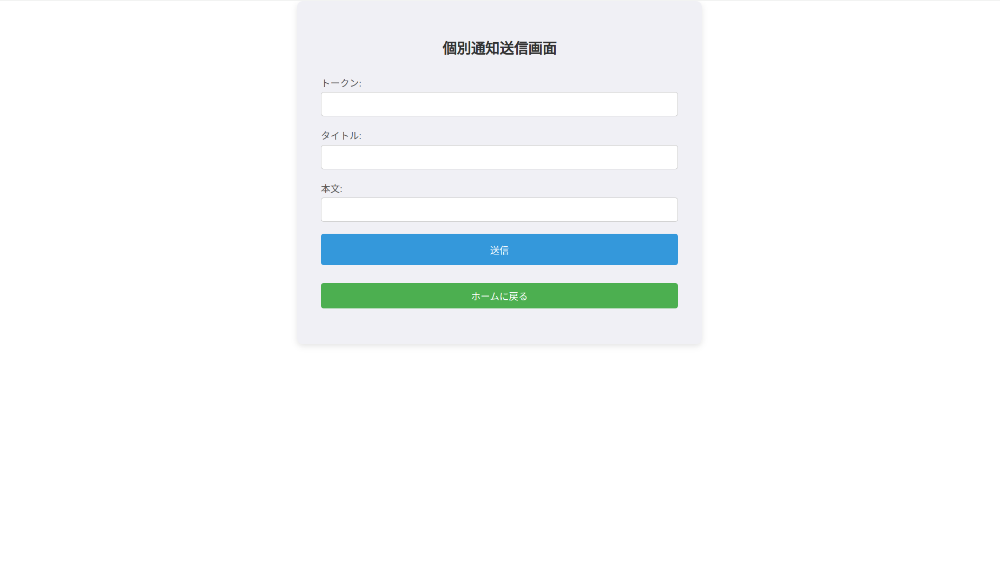
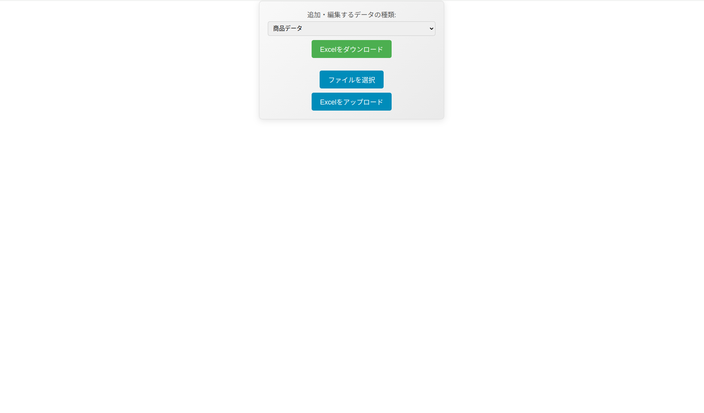
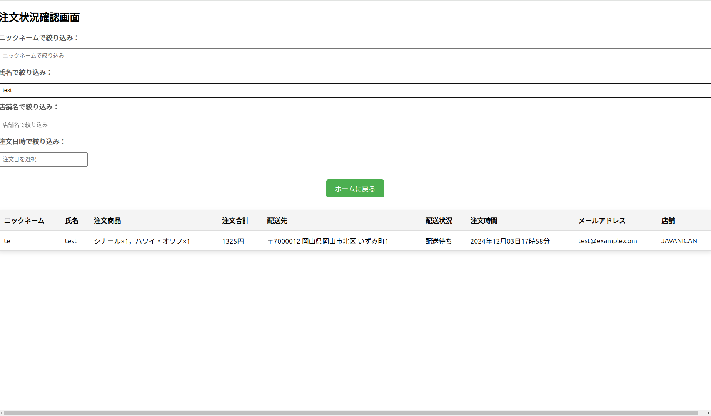

# latin1_one_client
latin1_one_client is part of an order management system.<br>latin1_one_client is a tool used in combination with [latin1_one_server](https://github.com:ueno12345/latin1_one_server.git).<br>
latin1_one_client is part of the order management system management console.<br>

There are six screens in this management console.
1. Product and store information update screen
   + Add product and store information to DB

2. Notification transmission screen
   + Add product and store information for notification to DB

3. General notification transmission screen
   + Add information for notification to DB

4. Individual notification transmission screen
   + Add information for individual notification to DB

5. Excel screen
   + Add product and store information to DB using excel

6. Order status confirmation screen
   + Check the status of your product orders


# Requirements
+ node v20.10.0

# Setup
## latin1_one_client
1. Download latin1_one_client
   ```bash
   $ git clone https://github.com:ueno12345/latin1_one_client.git
   ```

# Preparation
1. Set up [latin1_one_server](https://github.com:ueno12345/latin1_one_server.git)

# Launch
1. Execute `npm install`
   ```bash
   $ npm install
   ```
2. Launch
   ```bash
   $ npm start
   ```
    After launching, open http://localhost:3000 in your browser to open the latin1_one_client screen
